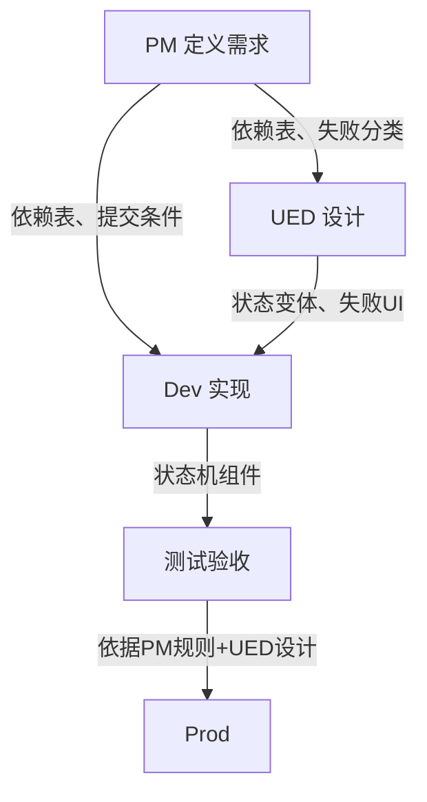

# 预览

<aside>
💡

可操作的组件演示

</aside>

# 1. 定位

## 组件定义

Data Submission 是一个统一的“数据提交执行模型”，用于规范所有涉及数据写入 / 提交 / 更新行为的系统流程。

- 统一所有数据结构（Input / Table / Hybrid / Multi-Step）的状态机驱动执行系统
    
    
    | 结构 | 作用 |
    | --- | --- |
    | Input 标准输入结构 | 普通的单页文本、下拉框组合表单 |
    | Table 数据表格 | 可编辑的“数据表格”组件、多行数据增删改查、批处理 |
    | Hybrid 复合型结构 | 复杂的多种数据结构混合看板（表单 + 可编辑表格 + 附件） |
    | Multi-Step 分步状态总线 | 长表单分步，所有步骤共享同一个全局数据上下文 |
- 统一定义四个核心能力：状态变化 + 依赖计算 + 执行管线 + 结果分类
    
    
    | 能力 | **作用** |
    | --- | --- |
    | **状态变化（State Machine）** | 控制流程，保证一致性，防止重复提交 |
    | **依赖计算（Dependency Graph）** | 显式建模联动规则，消除隐式耦合 |
    | **执行管线（Execution Pipeline）** | 标准化数据转换、安全拦截、异步发送 |
    | **结果分类（Failure & Success Taxonomy）** | 结构化成功/失败，支持部分成功与可恢复重试 |
    - 状态变化：不管上层用户在操作什么数据，整个系统严格遵循您前面定义的 5 个核心生命周期状态（`Idle` 闲置 `Editing` 交互中 `Submitting` 提交 `Success` 成功 `Error`失败）
        - 硬约束：提交瞬间，状态机切到 `Submitting`，全数据结构（无论是 Input 的禁用还是 Table 的只读锁）瞬间全局冻结，卡死重复提交
    - 依赖计算：在数据真正发给后端之前，系统在前端自动跑一遍“动态交叉校验”
        - 计算数据结构之间的联动校验（如：`Input` `Data Table`同时出现时，Input的“数额”必须大于Table里的总额等，如超边界，原地触发 `Error` 状态）。
        - 计算当前数据是否触发了边界情况，未通过直接拦截并原地触发 `Error` 状态
    - 执行管线：将数据从 UI 格式转换为后端所需格式，并注入安全与重试机制，如：
        - 管线 1（数据转换）：将 Figma/前端的 UI 变量（Variables）和多维数据，自动清洗转化为后端需要的标准 JSON 报文
        - 管线 2（安全拦截）：自动注入 Token、防重放攻击（Anti-CSRF）、或者唤起二步验证网关（MFA）
        - 管线 3（异步发送）：通过前面权衡出来的 Hook 扩展函数（Custom Hook Async Action） 真正把请求安全送出
    - 结果分类：对后端返回的所有响应结果进行标准化归类，对齐“失败优先设计”原则

## 设计目标

- 提供统一的数据提交行为规范
- 建立标准执行状态机
- 标准化“故障”分类体系
- 提供可解释的失败机制
- 降低重复表单逻辑开发成本
- 分离用户体验流程与执行逻辑

## 解决的问题

- 消除碎片化的提交逻辑
- 统一`error`处理与用户反馈
- 清晰表达复杂业务流程的依赖关系
- 表单 / 表格 / 步骤流不统一
- 无法表达部分成功（10 条成功 2 条失败）
- PM 无法判断流程复杂度，开发无法统一实现执行链

## 使用边界

#### 可使用场景

- 所有涉及数据“写入结果”的行为（Create、Edit、Delete、Submit）
- 需要依赖校验、批量处理、分步提交的场景

#### 不适用场景

- UI即时交互（如搜索、切换）
- 无状态展示组件（纯表格展示、卡片列表等）
- 纯视觉组件（按钮、图标等）

## 替代方案

- 当前方案：Data Submission `v1.0`
- 替代方案：未定义
- 被替代原因：不符合“设计目标”

---

# 2. 设计决策与演进

## 设计原则

| **原则** | **说明** |
| --- | --- |
| **流程优先** | 先保证业务闭环，再构建执行模型。设计阶段必须画出 UX 生命周期（Idle → Editing → Submitting → Success/Error）。 |
| **状态驱动** | 所有行为必须映射状态机，UI 只响应状态，不主动控制流程。见“详细描述” |
| **failure 是系统状态，而非提示** | 错误必须结构化、可分类、可追踪，不能仅作为 Toast 字符串。 |
| **dependency 必须显式建模** | 禁止隐式业务耦合（例如在组件内写 `if (fieldA > tableB.total)`）。依赖关系必须在 `dependencyGraph` 中声明。 |
| **submission ≠ execution** | 提交只是触发器，执行逻辑（转换、拦截、发送、重试）全部封装在管线中。 |
- 状态驱动
    - 把组件当成“状态机”，穷举并固化所有可能的状态
    - 无论是前端开发（如 React/Vue）还是 UE 设计，都必须用数据状态来控制界面。业务组件（Biz Component）在交付时，不能只给一个“正常显示”的样板
    - 状态机生命周期：
    
    ```mermaid
    stateDiagram-v2
        [*] --> Idle
        Idle --> Editing: 输入
        Editing --> Submitting: 点击提交
        Submitting --> Success: 成功
        Submitting --> Error: 失败
        Error --> Editing: 重试/修正
        Success --> [*]
    ```
    
    `Empty / Idle`（初始/闲置）：组件默认回填数据，接口加载时展示骨架屏 `Skeleton？`
    
    `Editing`（编辑/交互中）：系统实时拦截，校验输入的合规性
    
    `Submitting`（提交中）：等待接口响应，数据进入只读/锁定状态，阻止用户的任何二次点击，避免触发重复数据创建
    
    `Success`（成功）：业务流完美闭环。默认进入=入口页，同时反馈统一的回执数据。或进入其他流程的行动向导=跟随需求提供方
    
    `Error`（失败）：后端接口拒绝请求，流程被阻断，必须引导用户修正并重试
    
- 失败优先设计
    - 设计逻辑：优先考虑并设计网络断开、接口报错（500/404）、输入不合规、业务规则限制等边界情况。再设计成功路径。
    - 无障碍：出错提示必须严格执行“切勿仅依赖颜色（如红框）来传达含义”的规则，必须搭配明确的错误图标 ❗️ 和微文案
    - 失败状态汇总
        
        `Server Error`（服务器出错）：提示“系统繁忙，请稍后再试”
        
        `Network Offline / Timeout`（断网/超时）：提示“网络连接已断开，请检查网络”
        
        `Business Logic Error`（后端业务报错）：如“XXX”、“XXX”
        
        `穷举并补充`（注释）：Value
        
- 流程可复用
    - 概念：以前只复用一个“提交按钮”或“文本框”；现在要把`状态机生命周期`这一整套完整的数据提交流程，打包封装成一个高阶的业务组件 `eds-biz-data-submission`
    - 代码映射：在前端代码中，它对应的是一个自定义 React Hook（如 useFormSubmit）或一个高阶封装的业务流程组件（Biz Flow Component），其他产品线遇到相同的业务场景，直接调用该 ID 即可，无需重新编写交互逻辑

## 设计权衡

| **决策** | **取舍** |
| --- | --- |
| 灵活性 vs 一致性 | **一致性优先**：所有数据提交必须遵守统一状态机与执行管线。 |
| UI 简单性 vs 系统完整性 | **系统优先**：将异常（网络错误、依赖失败）提升为优先级最高的系统状态，而非局部布尔值。 |
| 开发速度 vs 长期维护 | **长期结构优先**：强制显式依赖建模与结构化失败分类，初期投入更多，但大幅降低维护成本。 |
- 灵活性 vs 一致性 → 一致性优先
    - 灵活性：允许各产品线自由魔改状态扭转，或在执行管线之外处理特殊的数据请求
    - 一致性：强行要求所有数据提交必须统一套用五大核心生命周期状态
- UI简单性 vs 系统完整性 → 系统优先
    - UI简单性：倾向于用局部布尔值（如 `isLoading`、`showErrorModal`）快速拼凑出表面的视觉界面，不干涉组件的原生 Tab 焦点和图层上下文
    - 系统完整性：要求将异常提升为优先状态
- 开发速度 vs 长期维护 → 长期维护优先
    - 开发快速：鼓励直接硬编码跨组件的数据依赖（例如在按钮组件里直接写 `if (form.fieldA === table.rowB)`），可以实现几分钟内快速上线
    - 长期维护：强制要求所有的多维异构数据联动必须在 `Dependency Evaluation`（依赖计算）管道中进行显式建模与声明式注册

## 演进记录

| **阶段** | **核心特征** | **存在的主要问题** |
| --- | --- | --- |
| 阶段一：无规范（UI-driven） | 每个页面独立实现提交逻辑 | 重复代码、状态不一致、错误无统一语义、依赖关系隐式、批量操作不支持部分成功 |
| 阶段二：校验层（Validation Layer） | 抽取公共校验函数，统一前端校验规则 | 校验与UI仍耦合、跨字段依赖分散、无全局提交锁、批量操作事务性（全或无） |
| 阶段三：执行层（Execution Layer）v1.0 | 状态机 + 依赖图 + 管线 + 分类器 + 草稿恢复 | 上述问题全部解决 |

---

# 3. 使用者指南

本系统将角色分为三层：UED（交互/视觉）、PM & 运营 & 外部协作方、Dev（前端/后端）。每一层都有明确的输入、输出和协作边界。

## UED

将业务需求转化为可执行的状态机视觉语言，并穷举所有失败分层。须交付的设计资产：

#### **须交付的设计资产**

| **资产** | **格式** | **说明** |
| --- | --- | --- |
| **UX 生命周期图** | FigJam | 明确 `Idle → Editing → Submitting → Success/Error` 的流转条件 |
| **执行层变体** | Figma 组件变体 | 穷举 `Idle`、`Editing`、`Submitting`、`Success`、`Error` 的视觉表现 |
| **失败分层 UI** | 设计稿（含交互注释） | 分别设计`Field`字段级、`Group`组级、`Dependency`依赖级、`System`系统级的错误反馈组件 |
| **依赖关系可视化** | 表格或连线图 | 标明哪些字段/表格之间存在联动校验（如“折扣金额 < 订单总额”） |

#### **详细交付指南**

1. **绘制 UX 生命周期流程图**
    - 使用以下标准模板，根据实际业务补充每个状态下的用户操作和界面变化。
    
    ```mermaid
    stateDiagram
        [*] --> Idle: 页面加载
        Idle --> Editing: 用户开始输入/编辑
        Editing --> Submitting: 点击提交按钮 & 前端校验通过
        Submitting --> Success: 后端返回成功
        Submitting --> Error: 后端返回失败 / 网络错误
        Error --> Editing: 用户修正数据
        Success --> [*]: 关闭页面/跳转/重置
    ```
    
    - 设计时必须明确标注：
        - 在 `Idle` 状态下，展示骨架屏、表单默认值继承组组件
        - 在 `Editing` 状态下，实时校验的触发时机（输入时、失焦时、提交时）？
        - 在 `Submitting` 状态下，表单的锁定范围（全部表单还是仅提交按钮？）以及加载文案（如“提交中，请勿关闭页面”）。
        - 在 `Success` 状态下，下一步行动是什么？（自动跳转、展示回执、清空表单、允许再次提交？）
        - 在 `Error` 状态下，是否保留用户已填数据？错误信息展示在何处？
2. **设计五大状态变体（Figma 变体）**
    
    为 `eds-biz-data-submission` 容器组件创建以下 5 个变体，确保开发可直接映射 CSS 类名。
    
    | **变体名** | **表单域状态** | **提交按钮状态** | **额外 UI 元素** |
    | --- | --- | --- | --- |
    | `Idle` | 可编辑，无锁 | 正常，可点击 | 加载时使用骨架屏 |
    | `Editing` | 可编辑，实时校验反馈 | 正常，可点击 | 字段下方动态提示 |
    | `Submitting` | 全部禁用/只读，透明度降低 | 显示加载图标，禁用点击 | 全局 loading 蒙层（可选）“再讨论” |
    | `Success` | 保持只读或清空？ | 按钮变为“已完成”或隐藏 | 成功 Toast / 弹窗 / 跳转 |
    | `Error` | 恢复可编辑，但错误字段高亮（继承相关组件反馈样式） | 恢复可点击，文案仍为“提交” | 错误摘要面板 |
3. **设计失败分层 UI（最关键）**
    
    必须为以下四层分别设计独立组件。绝对禁止只用一个红色边框表示所有错误。
    
    - `Field` 字段级失败
        - 触发条件：单个输入框/浮层触发器 规则错误、必填项为空、@PM。
        - UI 组件：`Input` 输入框 / `Floating_Trigger`组件状态机相关样式。
        - 交互：用户修改内容后，该错误实时消失。如默认有注释，则依次显示注释信息。
    - `Group` 组级失败
        - 触发条件：一组字段组合校验失败（如“密码”与“确认密码”不一致）。
        - UI 组件：`Streamer`页面顶部区域的显示警告条（横幅）
        - 交互：用户修改内容后，横幅消失。组里的组件集成组件状态机样式。
    - `Dependency` 依赖级失败
        - 触发条件：跨数据项联动校验失败（如“申请金额”大于“可用余额”）。
        - UI 组件： `Toast`（位于页面顶部）。高亮所有相关的字段，并提供“修改”快捷入口？
    - `System` 系统级失败
        - 触发条件：网络断开、服务器 500、超时（补充@all）。
        - UI 组件：`Page` 全屏，包含错误编号、诊断建议和“重试”按钮。
4. **标注依赖关系（用于开发实现）**
    
    在需求评审阶段，UED 需协同 PM 画出依赖关系表，作为 `dependencyGraph` 依赖图输入。
    
    示例：加密货币转账表单
    
    | **依赖 ID** | **条件（自然语言）** | **影响字段** | **失败文案** |
    | --- | --- | --- | --- |
    | `balance_sufficient` | 转账金额 ≤ 可用余额 | 转账金额、可用余额 | 转账金额超过可用余额，请减少金额或充值 |
    | `valid_wallet_address` | 收款钱包地址格式正确且非自身地址 | 收款地址 | 收款地址无效或为自身地址，请检查后重试 |
    | `daily_limit` | 当日累计转账金额 ≤ 单日限额 | 转账金额、当日已转金额 | 当日累计转账金额已达上限（$10,000），请明日再试 |
    | `gas_fee_sufficient` | 矿工费 ≤ 账户中的 gas 预留 | 矿工费、gas 预留 | 矿工费不足，请预留至少 0.001 ETH 作为手续费 |

> ✅ 允许：使用状态机变体、设计独立的错误组件、在注释中写“此错误依赖计算”。
> 
> 
> ❌ 禁止：只画成功态、用单一红色样式表示所有错误、遗漏 `Submitting` 态。
> 

## PM & 外部协作方

在需求文档中明确`状态流转条件`、`失败分类`、`依赖关系`，并评估流程复杂度。

#### **必须定义的内容清单**

| **条目** | **说明** | **示例** |
| --- | --- | --- |
| **提交触发条件** | 什么操作会启动提交？ | 点击“确认支付”按钮 |
| **前端校验规则** | 哪些字段不能为空/格式错误？ | 手机号11位数字 |
| **依赖计算规则** | 字段间如何相互影响？ | “满减金额” ≤ “订单总额” |
| **成功后的行为** | 跳转、弹窗、刷新列表？ | 跳转至订单详情页 |
| **失败分类与文案** | 为每种失败类型提供用户指引 | 见上文失败分层 |
| **部分成功策略** | 批量操作时允许部分成功吗？ | 10条记录中允许2条失败，显示失败列表 |

#### **详细交付指南（以“创建交易”需求为例）**

1. 用自然语言描述 UX 生命周期
    
    > 用户进入页面时，处于 [`Idle`] 状态，表单展示默认值（`……` 或 `继承组件`）。
    用户修改任意字段后，状态转为 [`Editing`]，实时校验（`……`）。
    用户点击 [提交] 按钮后，先执行前端校验和依赖计算，若通过则进入 [`Submitting`]，按钮状态显示“loading”，所有表单禁止编辑。
    若后端返回成功，转入 [`Success`]，显示“交易创建成功，交易号 XXXX”，3 秒后自动跳转到列表页。
    若后端返回失败（例如余额不足），转入 [`Error`]，在页面顶部展示错误原因，表单恢复可编辑，用户可修改后重新提交。
    > 
2. 穷举所有失败类型并撰写用户提示
    
    
    | **失败类型** | 级别 | **后端错误码** | **用户提示文案** | **附加操作** |
    | --- | --- | --- | --- | --- |
    | 余额不足 | `dependency_failure` | `INSUFFICIENT_BALANCE` | “账户余额不足，请充值后再试” | 提供充值链接 |
    | 风控拦截 | `dependency_failure` | `RISK_BLOCK` | “本次交易存在风险，已暂时限制” | 联系客服 |
    | 网络超时 | `System` | `TIMEOUT` | “网络超时，请检查网络后重试” | 重试按钮 |
    | 系统错误 | `System` | `500` | “系统繁忙，请稍后再试” | 重试按钮 |
3. 明确依赖关系（必须与开发对齐）
    
    用表格形式列出所有跨字段依赖，作为验收标准。
    
    | **依赖规则** | **前置条件** | **后置行为** |
    | --- | --- | --- |
    | 收款方账号不能等于付款方账号 | 两个字段都填写 | 实时提示“不能给自己转账” |
    | 转账金额 ≤ 单笔限额 | 金额字段变化 | 超过限额时置灰提交按钮，并显示限额提示 |
4. 定义部分成功策略（如果涉及批量操作）
    - 是否允许部分成功？
        - 是 → 需定义成功/失败列表的 UI 展示方式（如两个表格），并提供“仅重试失败项”的按钮。
        - 否 → 必须全部成功或全部失败（事务性）。

> ✅ 允许：在需求中直接引用 `eds-biz-data-submission`，并填写上述表格。
> 
> 
> ❌ 禁止：说“只需要做一个提交按钮，失败弹个提示就行” —— 必须明确失败分类。
> 

## Dev

实现`State Machine` 状态机、`Dependency Resolver` 依赖解析器、`Execution Pipeline` 执行管线、`Failure Classifier` 失败分类器，并消费 UED 的状态变体与 PM 的规则表。

#### **须实现的模块接口**

| **模块** | **输入** | **输出** | **文件位置示例** |
| --- | --- | --- | --- |
| State Machine | 事件 (`SUBMIT`, `RETRY`, `RESET`) | 状态 (`idle`, `editing`, `submitting`, …) | `hooks/useDataSubmission.ts` |
| Dependency Resolver | 表单数据 `T` | `{ passed: boolean, errors: DependencyError[] }` | `resolvers/dependencyGraph.ts` |
| Execution Pipeline | 转换后数据 | Promise `<Response>` | `pipeline/executionPipeline.ts` |
| Failure Classifier | 任何 `Error` | `StandardFailure` | `classifiers/failureClassifier.ts` |

#### **详细对接步骤 (示例，参数与UED文档为准)**

1. 安装依赖并引入 Provider
    
    ```tsx
    import { DataSubmissionProvider, useDataSubmission } from '@eds/biz-data-submission';
    
    // 包裹表单区域
    <DataSubmissionProvider
      initialValue={defaultFormData}
      onSubmit={apiSubmit}
      dependencyGraph={dependencyRules}
      onSuccess={handleSuccess}
      onError={handleError}
    >
      <ComplexForm />
    </DataSubmissionProvider>
    ```
    
2. 根据 UED 的五大状态变体编写样式映射
    
    ```tsx
    /* 状态类名由组件库自动切换，开发只需提供对应样式 */
    .data-submission--idle { }
    .data-submission--editing { }
    .data-submission--submitting { pointer-events: none; opacity: 0.7; }
    .data-submission--success { }
    .data-submission--error { }
    ```
    
    1. 根据 PM 的依赖表实现 `dependencyGraph`依赖图
    
    ```tsx
    const dependencyRules: DependencyRule[] = [
      {
        id: 'amount_gt_total',
        condition: (data) => data.amount <= data.total, // 注意：条件为“通过”时返回 true
        errorMessage: '订单金额不能超过商品总价',
        affectedFields: ['amount', 'total']
      }
    ];
    ```
    
3. 实现执行管线（含安全拦截与数据转换）
    
    ```tsx
    const executionPipeline = async (data: any) => {
      const transformed = transformToBackendFormat(data);   // 管道1
      const secured = await injectSecurityHeaders(transformed); // 管道2
      const response = await apiClient.post('/submit', secured); // 管道3
      return response.data;
    };
    ```
    
4. 消费失败分类，渲染对应的错误 UI
    
    ```tsx
    const { failure } = useDataSubmission();
    if (failure?.type === 'field_failure') {
      return <FieldError message={failure.message} />;
    } else if (failure?.type === 'dependency_failure') {
      return <DependencyError dependencies={failure.dependencies} />;
    }
    // ...
    ```
    
5. 单元测试与集成测试要求
    - 状态机测试：覆盖所有状态转移（`Idle → Editing → Submitting → Success` 以及 `Error → Editing`）。
    - 依赖图测试：提供至少 3 组测试数据验证依赖条件正确性。
    - 失败分类测试：模拟网络错误、业务错误、校验错误，验证 `FailureClassifier` 输出正确类型。
    - 草稿保持：离开也没或退出时，保存草稿。

> ✅ 允许：使用 `useDataSubmission` Hook 替代所有手写 `loading`/`error` 状态。
> 
> 
> ❌ 禁止：在组件内部直接调用 `axios.post` 绕过执行管线。
> 
> ❌ 禁止：在 `onSubmit` 中做依赖校验 —— 依赖校验必须放入 `dependencyGraph`依赖图。
> 
- **开发联调检查清单**
    - [ ]  提交后表单立即锁定，无法编辑。
    - [ ]  提交期间重复点击提交按钮不会产生二次请求。
    - [ ]  字段级错误展示正确文案，用户修改后错误消失。
    - [ ]  依赖级错误阻止提交，并高亮所有关联字段。
    - [ ]  网络断开时展示系统级错误面板，点击重试能够重新触发管线。
    - [ ]  批量提交支持部分成功，并展示成功/失败列表。
    - [ ]  所有状态切换均符合 UED 提供的变体。

## 协作流程图



---

# 4. 结构拆解

| **层级** | **组件** | **职责** |
| --- | --- | --- |
| Container | `DataSubmission`（Provider） | 提供状态机上下文，管理全局提交锁 |
| Content | 表单域（Input、Table、Step 等） | 作为 children 传入，自动注入 `disabled` 属性（`submitting` 时强制只读） |
| Actions | 提交按钮、重置按钮 | 触发状态转换，内置加载、禁用逻辑 |
| Engine Layer | State Machine、Dependency Graph、Execution Pipeline、Failure Classifier | 执行核心逻辑，与 UI 解耦 |

---

# 5.  变体与状态系统

## **用户体验流程图（设计层）**

```
Idle → Editing → Submitting → Success
                 ↓
               Error
```

- `Idle`：初始加载状态（可能展示骨架屏）
- `Editing`：用户正在修改数据，实时校验
- `Submitting`：点击提交后，数据锁定，等待响应
- `Success`：提交成功，展示成功反馈
- `Error`：提交失败，展示结构化错误

## **执行状态机（系统层）**

更精细的状态机（供开发实现）：

```
idle → editing → validating → dependency_resolving → submitting → processing → result_classification
       ↑         ↓             ↓                      ↓            ↓            ↓
       └─────────┴─────────────┴──────────────────────┴────────────┴────────────┘
                                      (任何失败可回到 editing)
```

| **状态** | **说明** |
| --- | --- |
| `idle` | 未初始化或已重置 |
| `editing` | 用户正在编辑，数据未锁定 |
| `validating` | 前端字段校验（邮箱、必填等） |
| `dependency_resolving` | 执行依赖图计算（联动校验） |
| `submitting` | 进入执行管线，请求已发出但未返回 |
| `processing` | 后端处理中（长任务轮询） |
| `result_classification` | 收到响应，进行分类（成功/部分成功/失败） |

## **结果状态（终态）**

| **终态** | **说明** | **用户动作** |
| --- | --- | --- |
| `success` | 全部成功 | 跳转或展示成功页 |
| `partial_success` | 批量操作中部分成功（如批量更新 5 行，3 行成功 2 行失败） | 展示成功与失败清单，允许重试失败项 |
| `failure` | 完全失败 | 展示失败原因，用户修改后重试 |
| `recoverable_failure` | 临时性失败（网络超时、服务熔断），可自动重试 | 系统自动重试（指数退避），或提供“重试”按钮 |
| `rolled_back` | 后端事务回滚 | 提示“操作已被回滚，请重试” |

## **失败分类（必须结构化）**

| **类型** | **说明** | **示例** | **处理策略** |
| --- | --- | --- | --- |
| `field_failure` | 单个输入框校验失败 | “邮箱格式错误” | 继承组件失败反馈形式（输入框下方显示红色文案及图标） |
| `group_failure` | 一组字段组合失败 | “两次密码不一致” | 区块错误提示 |
| `dependency_failure` | 跨数据项联动失败 | “金额超过余额” | 阻止提交，展示依赖关系解释 |
| `execution_failure` | 执行管线内错误（如转换异常） | “JSON 序列化失败” | 系统错误页，需开发排查 |
| `system_failure` | 网络/服务器错误 | 500、断网、超时 | 全局错误面板 + 重试机制 |

## **状态原则**

- `failure` 是合法终态，不是异常分支。
- `partial_success` 是合法终态，必须提供失败项的重试入口。
- `error` 不等于单一状态，而是多种失败分类的统称。
- `execution` 必须可回溯：所有状态转换、管线执行步骤应记录日志，便于调试。

---

# 6. **状态机深度设计**

本节为状态机的工程化实现提供形式化定义、超时处理、可观测性、持久化恢复及高级模式（嵌套/并行状态），采用实现无关的规范描述。

## **状态机形式化定义**

- **状态节点**
    
    
    | **状态** | **类型** | **说明** |
    | --- | --- | --- |
    | `idle` | 原子状态 | 未初始化或已重置 |
    | `editing` | 原子状态 | 用户正在编辑，数据未锁定 |
    | `validating` | 原子状态 | 执行前端字段校验（必填、格式） |
    | `dependencyResolving` | 原子状态 | 执行依赖图计算（联动校验） |
    | `submitting` | 复合状态（可选） | 执行管线（转换、拦截、发送） |
    | `classifyingFailure` | 原子状态 | 对原始错误进行分类 |
    | `success` | 终态 | 提交成功 |
    | `error` | 原子状态 | 提交失败，包含失败分类信息 |
- **事件**
    
    
    | **事件** | **触发条件** |
    | --- | --- |
    | `INIT` | 页面加载，初始化数据 |
    | `INPUT_CHANGE` | 用户修改任何表单域 |
    | `SUBMIT` | 用户点击提交按钮 |
    | `VALIDATION_PASS` | 字段校验通过 |
    | `VALIDATION_FAIL` | 字段校验失败 |
    | `DEP_RESOLVE_PASS` | 依赖计算通过 |
    | `DEP_RESOLVE_FAIL` | 依赖计算失败 |
    | `SUCCESS` | 后端返回成功 |
    | `FAILURE` | 后端返回失败或管线抛错 |
    | `TIMEOUT` | 提交超时 |
    | `RETRY` | 用户在错误状态点击重试 |
    | `RESET` | 手动重置表单 |
- **状态转移表**
    
    
    | **当前状态** | **事件** | **下一状态** | **动作（副作用）** |
    | --- | --- | --- | --- |
    | `idle` | `INIT` | `editing` | 填充初始数据 |
    | `editing` | `SUBMIT` | `validating` | 触发校验 |
    | `validating` | `VALIDATION_PASS` | `dependencyResolving` | 开始依赖计算 |
    | `validating` | `VALIDATION_FAIL` | `error` | 记录字段错误，阻塞提交 |
    | `dependencyResolving` | `DEP_RESOLVE_PASS` | `submitting` | 进入执行管线 |
    | `dependencyResolving` | `DEP_RESOLVE_FAIL` | `error` | 记录依赖错误，阻塞提交 |
    | `submitting` | `SUCCESS` | `success` | 执行成功回调 |
    | `submitting` | `FAILURE` | `classifyingFailure` | 对错误分类 |
    | `submitting` | `TIMEOUT` | `error` | 记录超时失败 |
    | `classifyingFailure` | （自动） | `error` | 存储分类后的失败对象 |
    | `error` | `RETRY` | `editing` | 保留数据，清空错误 |
    | `error` | `RESET` | `idle` | 清空数据，重置表单 |
- **守卫条件**
    - `canSubmit`：仅在 `editing` 状态下且数据有变更时才允许提交。
    - `shouldRetry`：根据 `failure.recoverable` 标识决定是否显示重试按钮。

## **超时处理策略**

| **场景** | **超时时间** | **重试策略** | **用户提示** |
| --- | --- | --- | --- |
| 字段校验（本地） | 无超时（同步） | 不适用 | 立即反馈 |
| 依赖计算（可能含异步请求） | 5 秒 | 失败后不重试，转为 `dependency_failure` | “依赖服务超时，请稍后重试” |
| 执行管线 – 数据转换/安全拦截 | 2 秒 | 重试 1 次 | 若仍失败，转为 `execution_failure` |
| 执行管线 – 异步发送（POST） | 30 秒（可配置） | 指数退避，最多 3 次 | 超时后进入 `recoverable_failure`，展示“网络超时，点击重试” |
| 长任务轮询（processing） | 整体 2 分钟 | 轮询间隔 2 秒，超时后放弃 | “处理超时，请查看结果或联系客服” |
- **实现要点**：
    - 超时计时器在进入 `submitting` 状态时启动，退出时清除。
    - 超时事件 `TIMEOUT` 的优先级高于正常响应：若先超时则终止请求（使用 `AbortController`）。
    - 可重试的失败（`recoverable_failure`）在 `error` 状态下提供“重试”按钮，重置 `retryCount` 后重新进入 `editing` 再提交（或直接重新进入 `submitting` 带相同数据）。

## **状态可观测性与调试**

生产环境需要监控状态机运行情况，提供以下能力：

| **能力** | **实现方式** |
| --- | --- |
| **状态变更日志** | 监听每次状态转移，记录 `{ from, to, event, timestamp, context概要 }`，输出到控制台或发送到日志服务。 |
| **调试模式** | 初始化时传入 `debug: true`，打印详细的转移、动作、服务调用日志。 |
| **状态快照导出** | 提供 `getSnapshot()` 方法，返回当前状态、上下文（脱敏后）、最近事件列表。 |
| **可视化追踪** | 可选集成通用状态机可视化工具（如 Stately.ai 或自研面板）。 |
| **错误上报** | 当进入 `error` 状态时，自动将 `failure` 对象和上下文快照（脱敏）发送到监控平台（如 Sentry）。 |

**调试日志示例**：

```
[State] editing -> validating (event: SUBMIT)
[Validation] 开始校验... 通过
[State] validating -> dependencyResolving (event: VALIDATION_PASS)
[Dependency] 开始解析依赖图... 失败: 金额超过余额
[State] dependencyResolving -> error (event: DEP_RESOLVE_FAIL)
[Error] 类型: dependency_failure, 可重试: true
```

## **状态持久化与恢复（含草稿自动保存）**

#### **痛点与场景定义**

用户在使用长表单、多步骤流程或复杂数据提交页面时，经常会遇到：

- 误关闭浏览器标签页
- 点击页面内其他链接跳转后返回
- 浏览器崩溃或刷新
- 网络断线导致页面重载
- 多步骤表单中临时离开再回来

#### **目标**

在不增加用户认知负担的前提下，静默保存用户已录入的所有数据，当用户再次进入同一表单页面时，自动恢复上次的编辑状态，并明确提示“已恢复未提交的草稿”。

#### **适用范围**

- 任何使用 `eds-biz-data-submission` 且开启 `autosave` 配置的场景
- 多步骤流程（Multi-Step）必须支持步骤恢复
- 批量表格编辑（可编辑表格）需恢复每行数据
- 混合型输入（表单 + 表格 + 附件）需恢复所有数据

#### **核心设计原则**

| **原则** | **说明** |
| --- | --- |
| **静默保存** | 保存过程不打断用户操作，不显示保存提示（可提供 Toast “草稿已保存” 可选）。 |
| **用户可控** | 必须提供“清除草稿”或“重新开始”按钮。 |
| **安全优先** | 敏感字段（密码、身份证号、支付密码）**不得**存入本地存储，须标记 `sensitive: true`。 |
| **有限生命周期** | 草稿必须有有效期（默认 24 小时），超期自动删除。 |
| **明确恢复提示** | 恢复时显示提示条：“检测到上次未提交的草稿，是否恢复？”（默认恢复，用户可点击“忽略”）。 |
| **与后端协作** | 若提交成功后应自动删除草稿；若提交失败但部分成功，可保留草稿中的失败项。 |

#### **技术实现规范**

1. 存储介质与 Key 规则
    - 使用 **`localStorage`**（关闭浏览器后仍存在）或 **`sessionStorage`**（关闭标签页即清除），推荐 `localStorage` 且支持跨标签页同步。
    - Key 格式：`eds_draft_{页面路由}_{用户ID（可选）}`。例如 `eds_draft_/transaction/create_user123`。
    - 每个页面独立 Key，避免不同表单相互覆盖。
2. 保存触发时机与防抖
    - 监听表单数据变化（`INPUT_CHANGE` 事件）。
    - 使用 **防抖（debounce）** 延迟保存，默认 800ms，避免频繁写入。
    - 以下情况**强制立即保存**：
        - 用户离开页面（`beforeunload` 事件）
        - 步骤切换（多步骤表单中点击“下一步”）
        - 关闭弹窗/抽屉（若表单在弹窗内）
    - 提交成功后**立即删除**该页面的草稿。
3. 保存内容结构
    
    ```json
    {
      "version": "1.0",
      "savedAt": 1700000000000,
      "expiresAt": 1700086400000,
      "formType": "input | table | hybrid | multi-step",
      "currentStep": 2,
      "data": {
        "name": "张三",
        "email": "zhang@example.com",
        "items": [ { "id": 1, "price": 100 } ]
      },
      "metadata": {
        "scrollPosition": 350,
        "focusedField": "email"
      }
    }
    ```
    
    敏感字段处理：
    
    - 在表单域定义时标记 `sensitive: true` 的字段，**不会**存入 `localStorage`。
    - 恢复时，敏感字段显示为空或占位符“******”，用户需重新输入。
4. **恢复流程**
    
    页面加载时，`DataSubmission` 组件应执行以下流程：
    
    ```flow
    flowchart TD
        A[页面加载] --> B{检查 localStorage 中是否有<br>当前页面的草稿}
        B -->|无| C[正常初始化]
        B -->|有| D{草稿是否在有效期内？}
        D -->|过期| E[删除草稿，正常初始化]
        D -->|有效| F[弹出恢复提示条]
        F --> G{用户选择}
        G -->|恢复| H[将草稿数据填充到表单,<br>恢复步骤索引]
        G -->|忽略| I[删除草稿，正常初始化]
        H --> J[可选：显示"已恢复草稿"通知]
    ```
    
    恢复提示条 UI 示例：
    
    ```
    ┌─────────────────────────────────────────────────┐
    │ 📝 检测到上次未提交的草稿（保存于 10:35）        │
    │ [ 恢复草稿 ]   [ 忽略，重新填写 ]               │
    └─────────────────────────────────────────────────┘
    ```
    
5. **与状态机的集成**
    - 恢复草稿时，派发 `RESTORE_DRAFT` 事件，状态机从 `idle` 或 `editing` 切换到 `editing`，并将草稿数据合并到 `context.data`。
    - 恢复后，状态机应**自动运行一次依赖计算**（但不可触发提交），以验证恢复的数据是否仍然满足依赖规则。若有依赖错误，可显示警告条但不阻止编辑。
    - 若恢复后用户再次提交并成功，则删除草稿。
6. **清理策略**
    
    
    | **场景** | **行为** |
    | --- | --- |
    | 用户主动点击“清空草稿”按钮 | 删除 localStorage 中的草稿，重置表单 |
    | 草稿超过有效期（默认 24 小时） | 下次进入页面时自动删除，不提示恢复 |
    | 用户提交成功 | 立即删除草稿 |
    | 用户提交失败（错误可重试） | **不删除草稿**，保留用户已填数据 |
    | 用户提交部分成功（`partial_success`） | 保留草稿，但可将成功项标记为只读，失败项保留可编辑 |
    | 用户手动清除浏览器数据 | 无恢复，正常初始化（用户主动行为） |
    
    **配置 API**
    
    业务方可通过 `autosave` 参数开启草稿功能：
    
    ```tsx
    interface AutosaveConfig {
      enabled: boolean;           // 是否开启草稿自动保存，默认 false
      debounceMs?: number;        // 防抖延迟，默认 800ms
      storage?: 'local' | 'session'; // 默认 'local'
      ttlMs?: number;             // 有效期（毫秒），默认 24 * 60 * 60 * 1000
      excludeSensitive?: boolean; // 是否排除敏感字段，默认 true
      promptOnRestore?: boolean;  // 是否显示恢复提示条，默认 true
      maxSizeBytes?: number;      // 最大存储大小（KB），默认 100KB，超过则警告并不保存
    }
    ```
    
    **使用示例**：
    
    ```tsx
    <DataSubmissionProvider
      initialData={defaultData}
      onSubmit={apiSubmit}
      autosave={{
        enabled: true,
        debounceMs: 600,
        ttlMs: 12 * 60 * 60 * 1000  // 12小时
      }}
    >
      {/* 表单内容 */}
    </DataSubmissionProvider>
    ```
    
    **多步骤表单的特殊要求**
    
    - 保存内容中必须包含 `currentStep`。
    - 恢复时不仅恢复数据，还要跳转到对应的步骤，并恢复该步骤下所有字段的值。
    - 每完成一个步骤（点击“下一步”）强制保存当前步骤数据。
    - 若用户在某步骤点击“上一步”，也应触发保存（以便草稿能反映最新状态）。
    
    **可编辑表格的草稿恢复**
    
    - 对于动态增删行的表格，需要保存完整的行数据数组。
    - 恢复时，表格应重新渲染出相同数量的行，并填充每个字段的值。
    - 若后端数据在此期间发生变化（如库存减少），恢复后应重新进行依赖计算，并提示用户某些行已失效。
    
    **安全与隐私**
    
    - 敏感字段不存本地存储，恢复后需用户重新输入。
    - 若页面包含用户证件照片、文件等，只存储文件 ID 或 URL，不存储 base64 内容。
    - 草稿数据不得自动同步到多端（如手机与电脑），仅限当前浏览器。
    - 可在页面提供“清空所有草稿”功能，让用户主动清除。
    
    **验收标准（用于测试）**
    
    | **场景** | **预期结果** |
    | --- | --- |
    | 用户填写表单部分字段后刷新页面 | 页面加载后弹出恢复提示，点击恢复后原字段值重新出现 |
    | 用户填写后主动提交成功 | 再次进入同一页面，无恢复提示，表单为空或初始状态 |
    | 用户填写后离开页面（点击外部链接），再返回 | 草稿自动恢复，且恢复提示条显示保存时间 |
    | 草稿超过有效期（手动调时间） | 进入页面不提示恢复，直接显示空白表单 |
    | 敏感字段（如密码） | 恢复后密码字段为空，不会显示旧值 |
    | 多步骤表单：在步骤2填写后刷新 | 恢复后直接跳转到步骤2，且步骤2数据完整 |
    | 表格：添加3行数据后刷新 | 恢复后表格仍显示3行，且每行数据正确 |
    | 提交失败（余额不足）后刷新 | 草稿仍存在，恢复后显示错误提示，用户可修改重试 |
    | 用户点击“忽略草稿” | 草稿被删除，表单重置，不再提示 |
    
    **与其他功能的兼容性**
    
    - 与 `partial_success` 共存：部分成功后，草稿保留但将成功项标记为只读，防止重复提交。
    - 与 `dependencyGraph` 共存：恢复后自动重新计算依赖，若依赖失败，显示警告但不阻塞用户编辑。
    - 与 `validating` 共存：恢复后应触发字段级校验，错误字段高亮，但无需立即提交。
    
    ## **嵌套状态与并行状态（交互拓展：待定）**
    
    **嵌套状态（Hierarchical States）**
    
    当 `submitting` 状态内部有多个子阶段时，使用嵌套状态实现细粒度进度反馈。
    
    **子状态图**：
    
    ```mermaid
    stateDiagram-v2
        state submitting {
            [*] --> transforming
            transforming --> securing: TRANSFORM_DONE
            securing --> sending: SECURE_DONE
            sending --> [*]: SEND_DONE
        }
    ```
    
    **UI 反馈映射**：
    
    - `submitting.transforming` → 提示“正在转换数据…”
    - `submitting.securing` → 提示“正在加密/添加安全头…”
    - `submitting.sending` → 提示“正在提交，请稍候…”

**并行状态（Parallel States）**

- 批量提交多条独立记录时，使用并行状态同时管理每个子任务。并行结构示意图：
    
    ```
    batchSubmitting (并行区域)
    ├── task1 (小状态机: idle → submitting → success/error)
    ├── task2
    └── task3
    ```
    
- 每个子任务拥有自己的局部状态机，主状态机聚合所有子任务的最终结果：
    - 全部子任务状态为 `success` → 主状态进入 `success`
    - 至少一个子任务为 `error` → 主状态进入 `partial_success`
    - 同时记录 `successItems` 和 `failedItems` 列表

**实现注意**：并行状态会增加内存开销，建议子任务数量 ≤ 20。超过时使用队列顺序执行（串行），但用户体验上仍可显示整体进度。

## **状态机配置规范（实现无关）**

- 为统一业务方使用体验，建议所有实现都提供以下高层配置接口（形式不限，但字段语义必须一致）：
    
    
    | **配置项** | **类型** | **说明** |
    | --- | --- | --- |
    | `initialData` | `object` | 初始表单数据 |
    | `onSubmit` | `(data) => Promise` | 提交函数，必须返回 Promise |
    | `validate` | `(data) => { valid, errors }` | 可选，字段级校验函数 |
    | `dependencyGraph` | `DependencyRule[]` | 可选，依赖规则数组 |
    | `transform` | `(data) => any` | 可选，数据转换函数 |
    | `securityHeaders` | `() => object` | 可选，返回安全头（Token、CSRF） |
    | `timeout` | `number` | 提交超时时间（ms），默认 30000 |
    | `retryConfig` | `{ maxAttempts, backoffFactor }` | 可选，重试策略 |
    | `debug` | `boolean` | 是否开启调试日志 |
    | `onTransition` | `(from, to, event) => void` | 状态变化回调 |
    | `persist` | `boolean | object` | 持久化配置（key, storage） |
    | `onSuccess` | `(response) => void` | 成功回调 |
    | `onError` | `(failure) => void` | 失败回调 |
    

---

# 7. 交互行为

## 核心原则

- UI 不控制流程：点击提交只是触发状态机事件，状态机决定后续行为。
- 所有交互 → 状态变化触发：无直接调用提交 API 的硬编码。
- failure 决定反馈层级：根据失败类型弹出对应层级的 UI。

## 执行链路（完整流程）

```
1. 用户点击提交
   ↓
2. 状态机从 editing → validating
   ↓
3. validating 通过 → dependency_resolving
   （未通过 → failure: field_failure/group_failure）
   ↓
4. dependency_resolving 通过 → submitting
   （未通过 → failure: dependency_failure）
   ↓
5. submitting 触发执行管线：
   - 数据转换（transform）
   - 安全拦截（inject token、csrf、mfa）
   - 异步发送请求
   ↓
6. 收到响应 → processing（若为异步长任务则轮询）
   ↓
7. result_classification：
   - 全部成功 → success
   - 部分成功 → partial_success（返回成功/失败列表）
   - 完全失败 → failure（子类型：execution_failure / system_failure）
   - 可恢复失败 → recoverable_failure（自动重试或展示重试按钮）
```

## **反馈层级（UI 实现）**

| **层级** | **触发条件** | **UI 组件** | **ARIA 属性** |
| --- | --- | --- | --- |
| Field | `field_failure` | 输入框下方红色文案 + 图标 | `aria-describedby="field-error-id"` |
| Group | `group_failure` | 区块顶部黄色/红色警告条 | `role="alert"` |
| Dependency | `dependency_failure` | 弹窗或全局消息条，高亮关联字段 | `aria-live="assertive"` |
| System | `system_failure` | 全屏蒙层 + 错误详情 + 重试按钮 | `aria-live="polite"` |

## **部分成果（Partial Success）**

当批量操作返回部分成功时：

- 数据模型：`result.successItems` 和 `result.failedItems` 分别列出成功/失败的数据项标识。
- UI 表现：展示汇总信息（例如：“成功更新 3 条，失败 2 条”），并提供“仅重试失败项”按钮。
- 重试机制：重新调用执行管线，但只发送 `failedItems`。

---

# 8. 数据模型与逻辑

## 完整模式

```json
{
  "id": "submission-123",
  "type": "input | table | hybrid | multi-step",
  "state": "editing",
  "dependencyGraph": [
    {
      "id": "amount_gt_total",
      "condition": "form.amount > table.total",
      "errorMessage": "金额不能超过订单总额",
      "affectedFields": ["amount", "table.total"]
    }
  ],
  "validation": {
    "fieldErrors": {
      "email": "邮箱格式错误",
      "phone": "手机号必须为11位数字"
    },
    "groupErrors": {
      "password_group": "两次密码输入不一致"
    },
    "dependencyErrors": [
      {
        "id": "amount_gt_total",
        "message": "金额不能超过订单总额",
        "fields": ["amount", "table.total"]
      }
    ]
  },
  "execution": {
    "stage": "validate | resolve | execute | classify",
    "pipelineLog": []
  },
  "result": {
    "status": "success | partial_success | failure | recoverable_failure | rolled_back",
    "successItems": [{ "id": "row1", "data": {} }],
    "failedItems": [{ "id": "row2", "reason": "库存不足" }],
    "errorCode": "INSUFFICIENT_BALANCE",
    "message": "用户友好提示"
  },
  "metadata": {
    "startTime": "2026-06-05T10:00:00Z",
    "endTime": "2026-06-05T10:00:02Z"
  }
}
```

## 映射规则

| **字段** | **UI 表示** | **规则** |
| --- | --- | --- |
| `state` | 表单可用性、提交按钮状态 | 状态机驱动 |
| `validation.fieldErrors` | 每个输入框下方红色文案 | 实时校验更新 |
| `validation.dependencyErrors` | 阻止提交，弹出提示 | 依赖计算管道输出 |
| `result.status` | 成功/部分成功/失败的视觉风格 | 根据状态展示 Toast / Modal / 详情面板 |
| `result.failedItems` | 失败列表，每项带重试按钮 | 用户可点击重试单个失败项 |

## 空状态

- 当表单没有初始数据时，展示骨架屏（`Idle` 状态）。
- 当表格没有数据行时，展示“暂无数据，请新增”按钮。

## 错误状态

- 字段级错误：实时校验展示。
- 依赖级错误：提交时才触发（因为依赖计算成本较高），并阻止提交。
- 系统级错误：任何时候都可能发生，使用全局错误边界捕获。

---

# 9. 使用规范

## 允许 Do

- 必须使用执行管线处理所有提交请求。
- 依赖关系必须通过 `dependencyGraph` 显式定义。
- 失败必须分类，不允许使用未分类的通用错误字符串。
- 状态及为唯一真相源，UI 只响应状态，不主动修改。

## 禁止 Don’t

- UI 不得控制“提交”流程（如在 `onClick` 中直接调用 API）。
- 不得使用未分类的 `error`（如 `catch (e) { setError(e.message) }` 不区分类型）。
- 不得使用隐式依赖关系（如组件内直接 `if (a > b)`）。
- 不得绕过执行管线（如直接调用 axios 而不经过管线的安全拦截）。

## 约束

- 所有“提交”必须进入“状态机”，禁止裸调用。
- 所有 “失败” 必须结构化（包含 `type`、`message`、`fields` 等）。
- 所有依赖关系必须可追踪（通过 `dependencyGraph` 中的唯一 id）。

---

# 10. 开发实现

## **核心模块**

| **模块** | **职责** | **输入 → 输出** |
| --- | --- | --- |
| **State Machine Engine** | 管理状态转换，发送事件 | 事件（SUBMIT、RETRY、RESET）→ 新状态 + 副作用（调用管线） |
| **Dependency Resolver** | 解析依赖图，返回是否满足 | 当前数据 → `{ passed: boolean, errors: DependencyFailure[] }` |
| **Execution Pipeline** | 顺序执行：转换 → 拦截 → 发送 → 重试 | 原始数据 → 转换后数据 → 注入安全头 → Promise |
| **Failure Classifier** | 将错误分类为标准类型 | `Error` 对象 → `{ type, message, recoverable }` |

## **状态流（伪代码）**

```tsx
class DataSubmission {
  private stateMachine: StateMachine;
  private resolver: DependencyResolver;
  private pipeline: ExecutionPipeline;
  private classifier: FailureClassifier;

  async submit(data: any) {
    this.stateMachine.send('SUBMIT'); // idle → validating
    const validation = this.validate(data);
    if (!validation.valid) {
      this.stateMachine.send('FAIL', { errors: validation.errors });
      return;
    }
    this.stateMachine.send('VALIDATED'); // validating → dependency_resolving
    const deps = await this.resolver.resolve(data);
    if (!deps.passed) {
      this.stateMachine.send('FAIL', { errors: deps.errors });
      return;
    }
    this.stateMachine.send('DEPENDENCIES_RESOLVED'); // → submitting
    try {
      const response = await this.pipeline.execute(data);
      this.stateMachine.send('SUCCESS', response);
    } catch (rawError) {
      const classified = this.classifier.classify(rawError);
      this.stateMachine.send('FAIL', { error: classified });
    }
  }
}
```

## **性能策略**

- 依赖项缓冲 dependency cache：依赖计算结果缓存，仅当依赖字段变化时重新计算。
- 增量验证 incremental validation：字段级校验实时触发，但依赖计算仅在提交或关键字段变化时触发（防抖 300ms）。
- 批处理 batch execution：批量操作时分片发送，每片大小 ≤ 50 项，避免单次请求过大。

---

# 11. 组合与依赖关系

## 依赖组件

- `Input` ：提供表单输入控件（自动注入 `disabled`）。字段级校验规则（如 `isEmail`、`isRequired`）。
- `Flotation` ：提供覆层空间，字段级校验规则。
- `Button` ：按钮控件。
- `Data Table` ：提供可编辑表格（支持批量选择、行状态）。
- Step System：提供分步骤导航（每步共享同一数据上下文）。
- Request Client：封装 axios/fetch，自动注入 Token、CSRF。

## **依赖类型**

| **类型** | **说明** | **示例** |
| --- | --- | --- |
| **structural** | 字段依赖结构（如 A 字段必填则 B 字段显示） | 选择“公司”后，“税号”字段必填 |
| **data** | 字段值之间的数值/逻辑比较 | 折扣价 ≤ 原价 |
| **state** | 依赖其他组件状态（如表单是否 pristine） | 未修改时禁用提交按钮 |
| **execution** | 依赖前一步执行结果（多步骤流水线） | 步骤 1 上传文件成功后，步骤 2 才能提交 |

### **规则**

- 必须显式 dependency，不允许隐式关联。
- 依赖图必须是无环的（检测循环依赖并在开发阶段报错）。
- 依赖变化会触发重新计算（如监听字段变化，重新执行 resolver）。

---

# 12. 无障碍

| **要求** | **实现方式** |
| --- | --- |
| **state change 必须 aria-live** | 使用 `aria-live="polite"` 或 `assertive` 朗读状态变化（如“提交成功”）。 |
| **error 必须语义化** | 错误区域使用 `role="alert"`，并提供 `aria-describedby` 关联错误详情。 |
| **dependency 必须可解释** | 依赖失败时，除了高亮字段，还需显示解释性文案（如“金额超过余额，请减少数量”）。 |
| **submit feedback 必须结构化** | 成功/失败后焦点移至反馈区域（成功提示或第一个错误字段）。键盘用户可通过 Tab 快速定位错误。 |

---

# 13. 性能限制

- 大数据分片执行：批量提交超过 100 行时，自动分片（每片 ≤ 50 行），展示进度条。
- dependency graph memoization：依赖图计算结果缓存在 `Map` 中，键为依赖字段的哈希值。
- 增量验证：字段级校验使用 `debounce` 300ms，避免高频计算。
- 首屏 bundle 增量：本系统代码预计 ~15KB（gzip），依赖 XState 增加 12KB，总体 < 30KB。

---

# 14. 边界情况

| **场景** | **处理方式** |
| --- | --- |
| **循环依赖** （A 依赖 B，B 依赖 A） | 开发环境下抛出错误，提示修正依赖图；生产环境强制按初始化顺序解析并记录警告。 |
| 并行提交（用户快速点击两次提交） | 状态机在 `submitting` 状态下忽略新 SUBMIT 事件，防止重复请求。 |
| 模式不匹配（前端数据模型与后端不匹配） | 执行管线的“数据转换”阶段负责映射，若转换失败抛出 `execution_failure`。 |
| 部分回滚失败（批量操作中部分成功但回滚失败） | 进入 `partial_success` 终态，记录已成功部分，提示用户联系管理员。 |
| 网络中断（请求发送中网络断开） | 超时后转入 `recoverable_failure`，自动重试（最多 3 次，指数退避）。用户也可手动重试。 |
| 过期状态的执行（用户提交时数据已被其他人修改） | 后端返回版本冲突错误（HTTP 409），前端转入 `dependency_failure`，提示“数据已更新，请刷新后重试”。 |

---

# 15. 拓展性

| **扩展点** | **方式** | **示例** |
| --- | --- | --- |
| **插件验证引擎 plugin validation engine** | 允许业务方自定义校验函数（如调用后端校验接口） | `validationPlugins: [checkStock, checkCredit]` |
| **自定义依赖项解析器 custom dependency resolver** | 覆盖默认的同步解析器，支持异步依赖（如查询价格） | `dependencyResolver: async (data) => {...}` |
| **外部执行管线 external execution pipeline** | 允许业务方注入中间件（如埋点、加密） | `pipeline.use(middleware)` |
| **多域支持 multi-domain support** | 同一页面多个独立提交区域（如多个表单） | 每个 `DataSubmission` Provider 独立状态，互不干扰 |

**限制**：禁止绕过核心状态机直接修改状态；所有扩展必须通过官方插件接口注册。

---

# 16. 生命周期与版本管理

## 当前版本

v1.0

## 变更日志

| 版本  | 变更时间 | 变更类型 | 描述 | 影响 |
| --- | --- | --- | --- | --- |
| v1.0 | 2026 Q2 | 新增 | 统一状态机、依赖图、管线、分类器、草稿保持 | 未评估 |
|  |  |  |  |  |
|  |  |  |  |  |
|  |  |  |  |  |
|  |  |  |  |  |
|  |  |  |  |  |

## 已弃用

- UI 块提交模型：直接使用 `setLoading(true)` 并手动调 API 的模式不再允许。
- 隐式依赖逻辑 ：组件内直接写 `if (a > b)` 的隐式校验不再允许。

## 迁移指南（旧模式升级）

1. **UI submit → state machine（UI提交 → 状态机）**
    
    将原来在 `onSubmit` 中手动设置的 `loading`、`error` 状态替换为调用 `DataSubmission.submit()`，由状态机自动管理。
    
2. **string error → failure taxonomy（字符串错误 → 故障分类）**
    
    将原来 `catch (e) { setError(e.message) }` 改为调用 `FailureClassifier`，生成标准分类对象，并根据类型展示不同 UI。
    
3. **implicit logic → dependency graph（隐式逻辑 → 依赖图）**
    
    识别原有代码中的隐式联动（如 `if (form.amount > table.total)`），将其提取为 `dependencyGraph` 中的一个条目，并删除组件内的硬编码。